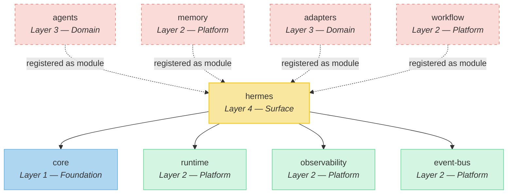
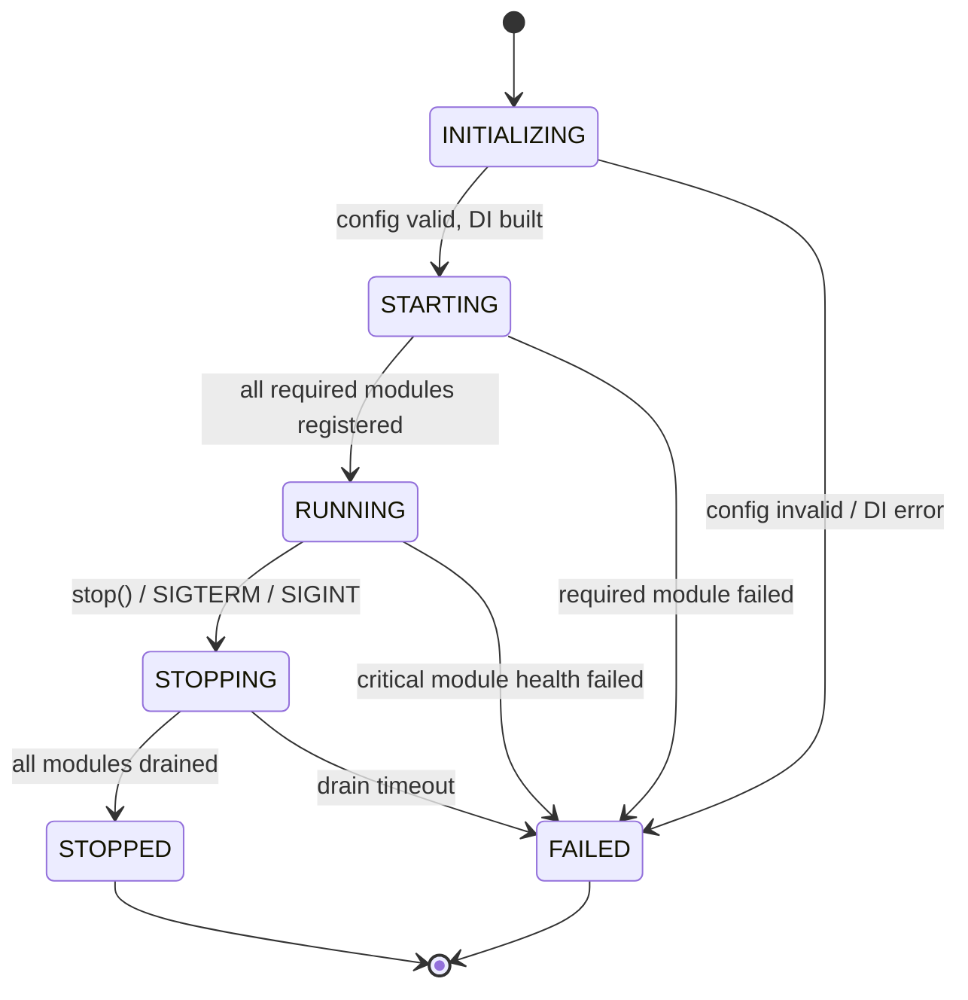
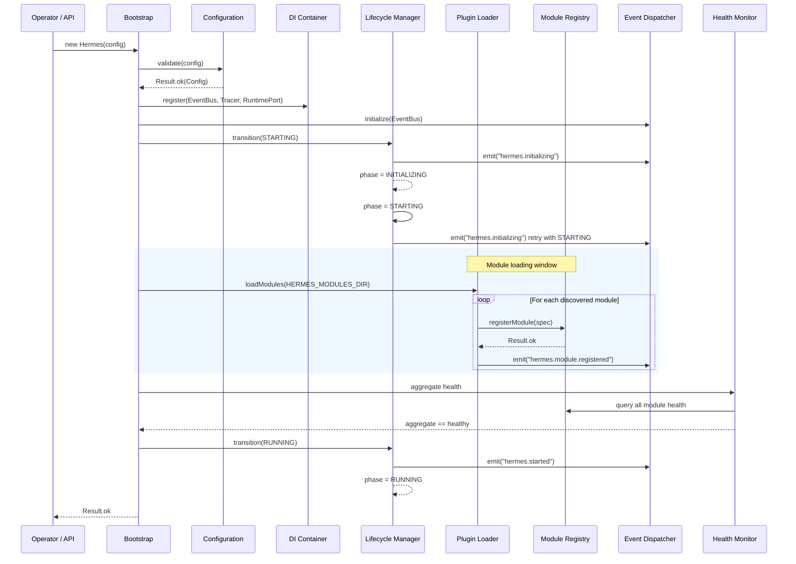
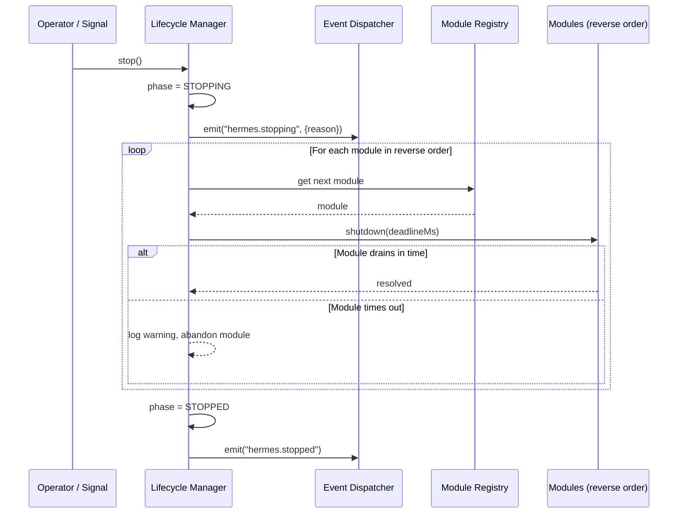

# Hermes Architecture Specification

> This document is the **source of truth** for the Hermes integration layer.
> No implementation code shall be written until this specification is complete
> and approved. All code in `packages/hermes/` must trace every decision back
> to a section of this document.

---

## 1. Hermes Overview

### 1.1 Purpose

Hermes is the top-level integration layer of Agent OS. It is the single
entry point that operators and higher-level surfaces use to boot, operate,
and shut down the agent runtime. Hermes does not implement domain logic —
it **composes** domain packages into a coherent, observable, lifecycle-managed
process.

Hermes is to Agent OS what `init` is to a POSIX system: the first process,
the last to terminate, and the arbiter of what runs beneath it.

### 1.2 Responsibilities

| Responsibility                         | Mechanism                                        |
| -------------------------------------- | ------------------------------------------------ |
| Bootstrap the runtime                  | Read configuration, build the DI container, start the lifecycle |
| Own the process lifecycle              | State machine with six phases, enforced transitions |
| Wire platform packages together        | Inject `EventBus`, `Tracer`, `RuntimePort` into modules at startup |
| Register and unregister modules       | Module registry with declared dependencies and health |
| Emit lifecycle events                  | Domain events on the `EventBus` for every phase transition |
| Report health                          | Aggregate health of all registered modules |
| Graceful shutdown                      | Drain modules in reverse registration order, emit `stopped` |
| Isolate dependency surface             | Depend on *four* packages only; all domain access is through ports |

### 1.3 Design Goals

1. **Narrow dependency surface.** Hermes imports from exactly four packages.
   All domain access (agents, memory, workflows) happens through module
   registrations that implement ports defined in those four packages.
2. **Single writer of lifecycle state.** Only the Lifecycle Manager may
   advance the phase. All other components are readers.
3. **Event-driven coordination.** Modules communicate through the `EventBus`,
   never through direct method calls on each other.
4. **Observable by default.** Every transition, module registration, health
   check, and error is traced via `@agent-os/observability`.
5. **Testable in isolation.** The DI container accepts hand-constructed
   dependencies so the full lifecycle can be exercised without Postgres,
   Redis, or network.
6. **Fail-closed.** If any required module fails to initialize, Hermes
   transitions to `FAILED` and does not partially start.

### 1.4 Non-Goals

- Hermes does **not** implement agent logic, memory retrieval, workflow
  execution, or model routing. Those are future modules that register with
  Hermes at runtime.
- Hermes does **not** expose an HTTP surface. The `apps/api` Fastify server
  owns all network I/O. Hermes is an in-process kernel.
- Hermes does **not** manage multi-tenant isolation, authentication, or
  authorization. Those concerns belong in `apps/api` middleware.
- Hermes does **not** depend on Node.js-specific APIs (`fs`, `net`, `child_process`)
  outside the Plugin Loader's filesystem scan. All other modules are
  platform-agnostic.

---

## 2. Core Modules

Hermes is composed of nine internal modules. Each module has a single
responsibility and communicates with other modules through the DI container
or the event bus — never through direct import of another module's internals.

### 2.1 Bootstrap

The entry point. Responsibilities:

- Read configuration from environment variables and optional config file.
- Validate configuration via Zod schema (schema defined in `hermes`, not
  in `shared`, because the shape is Hermes-specific).
- Construct the DI container with all resolved dependencies.
- Invoke the Lifecycle Manager to begin the `INITIALIZING` phase.
- Handle top-level `unhandledRejection` and `uncaughtException` by
  delegating to the Lifecycle Manager's failure path.

Bootstrap runs once. After the lifecycle manager has transitioned past
`INITIALIZING`, the Bootstrap module is inert.

### 2.2 Configuration

A read-only snapshot of everything Hermes needs to operate. Responsibilities:

- Parse and validate all config sources (env vars, config file, CLI flags).
- Provide typed access to config values with no `undefined` fields after
  validation.
- Freeze the config object after construction so no component can mutate it.
- Provide a `validate()` function that returns a `Result<Config, ZodError>`
  so Bootstrap can fail-closed on invalid input.

Required configuration keys:

| Key                     | Source                | Default       |
| ----------------------- | --------------------- | ------------- |
| `NODE_ENV`              | env                  | — (required)  |
| `LOG_LEVEL`             | env                  | `info`        |
| `OPENROUTER_API_KEY`    | env                  | — (required)  |
| `DATABASE_URL`          | env                  | — (required)  |
| `REDIS_URL`             | env                  | — (required)  |
| `OTEL_ENABLED`          | env                  | `false`       |
| `OTEL_EXPORTER_ENDPOINT`| env                  | — (optional)  |
| `HERMES_MODULES_DIR`    | env / config file     | `./modules`   |
| `HERMES_SHUTDOWN_TIMEOUT_MS` | env / config file | `30000`    |

### 2.3 Dependency Injection Container

The wiring layer. Responsibilities:

- Hold all instantiated services in a shallow, name-keyed registry.
- Provide a `resolve(name)` function that returns a previously registered
  service or throws.
- Provide a `register(name, factory)` function that constructs a service
  once and caches it (singleton semantics).
- Support `has(name)` for optional dependencies.
- Never auto-create services. Every registration is explicit, driven by
  Bootstrap.

The container is not a general-purpose service locator. Only Hermes-internal
modules and successfully loaded plugins may resolve from it. The container
does **not** expose a `list()` method — iteration over services is the
Module Registry's job.

### 2.4 Lifecycle Manager

The state machine. Responsibilities:

- Own the current `LifecyclePhase` value.
- Expose `currentPhase()` for readers.
- Expose `transition(to)` which validates that `to` is a legal successor
  of the current phase (see Section 3). Illegal transitions throw.
- On every successful transition, emit a lifecycle event through the
  Event Dispatcher.
- On a transition to `FAILED`, trigger the Health Monitor to capture
  failure details and then refuse all further transitions.

The Lifecycle Manager is the **only** component that may write the phase.
All other modules read it through `currentPhase()` or react to events
published by the Event Dispatcher.

### 2.5 Module Registry

The inventory of what is running. Responsibilities:

- Maintain an ordered list of registered modules.
- Each module record contains: name, version, declared dependencies, health
  status, and a reference to the module's shutdown handle.
- `registerModule(spec)` — validate that declared dependencies are already
  in the registry; reject with a descriptive error if not.
- `unregisterModule(name)` — remove a module; mark dependents as degraded.
- `list()` — return a snapshot of all registered modules.
- `get(name)` — return a single module record.

The registry orders modules by insertion so shutdown can drain in reverse.
No topological sort is performed at registration time; dependency ordering
is enforced by the "all deps must already be registered" rule, which
produces a valid reverse-drain order by construction.

### 2.6 Event Dispatcher

The internal adaptation of `@agent-os/event-bus`. Responsibilities:

- Acquire the `EventBus` instance from the DI container.
- Provide `emit(topic, payload)` — a typed convenience that wraps
  `EventBus.publish` and automatically attaches the current lifecycle phase
  and a timestamp from `@agent-os/core`.
- Provide `on(topic, handler)` — a typed convenience that wraps
  `EventBus.subscribe` and returns a subscription ID for later cleanup.
- On shutdown, unsubscribe all Hermes-internal subscriptions to allow
  clean process exit.

The Event Dispatcher does **not** implement a new transport. It is a thin
typed facade over the platform `EventBus` contract.

### 2.7 Health Monitor

The aggregation layer. Responsibilities:

- On `health()`, query every module in the Module Registry for its health
  status. Modules that do not expose a health check are marked `unknown`.
- Compute an aggregate status: `healthy` if all modules report `healthy`,
  `degraded` if one or more report `degraded` but none report `failed`,
  `failed` if any module reports `failed`.
- Return the aggregate plus per-module details.
- The Lifecycle Manager checks the Health Monitor on transition to `RUNNING`
  and will transition to `FAILED` if the aggregate is `failed`.

### 2.8 Plugin Loader

The extensibility mechanism. Responsibilities:

- Scan `HERMES_MODULES_DIR` (from Configuration) for module entry points.
- Each module entry point must export a `register(hermes)` function where
  `hermes` is a scoped facade exposing: Configuration (read-only), the DI
  Container (resolve only), the Event Dispatcher (emit + on), and the
  Module Registry (registerModule only).
- Validate that the module's declared name is unique in the registry.
- Load modules in filesystem sort order. If a module declares dependencies
  that are not yet registered, defer loading until all dependencies are
  present (single-pass retry). If after the retry any module still has
  unresolved dependencies, fail that module and log a warning; the Hermes
  lifecycle continues unless the module is marked `required`.
- On shutdown, the Plugin Loader does **not** unload modules. Shutdown is
  handled by the Lifecycle Manager draining the Module Registry.

### 2.9 Service Registry

The runtime wiring table. Responsibilities:

- Map well-known service names to instances in the DI Container.
- Provide a `lookup(name)` that is an alias for `Container.resolve(name)`.
- Define the set of well-known service names as a constant union type:

  | Service name            | Package              | Description                       |
  | ----------------------- | -------------------- | --------------------------------- |
  | `EventBus`              | `@agent-os/event-bus`| The event transport               |
  | `Tracer`                | `@agent-os/observability` | The OpenTelemetry tracer     |
  | `RuntimePort`           | `@agent-os/runtime`  | The lifecycle port                 |

- Future services (e.g., `MemoryStore`, `AgentPort`) will be added here
  **only** when those packages are integrated. Hermes never directly imports
  their packages — the entries appear because a plugin registered the
  service into the container.

---

## 3. Lifecycle

### 3.1 Phase Definitions

```
  INITIALIZING ──▶ STARTING ──▶ RUNNING
       │               │             │
       │               │             ▼
       │               │          STOPPING ──▶ STOPPED
       │               │
       ▼               ▼
     FAILED           FAILED
```

| Phase          | Meaning                                                          |
| -------------- | ---------------------------------------------------------------- |
| `INITIALIZING` | Bootstrap is reading config, building the DI container, and preparing the Event Dispatcher. No modules are running. |
| `STARTING`     | The Plugin Loader is discovering and registering modules. Each module's `register(hermes)` is invoked. The lifecycle has not yet committed to `RUNNING`. |
| `RUNNING`      | All required modules registered successfully. The system is fully operational and accepting work. |
| `STOPPING`     | A shutdown signal has been received. Modules are being drained in reverse registration order. New work is rejected. |
| `STOPPED`      | All modules have drained. The process may exit. No further transitions are possible. |
| `FAILED`       | An unrecoverable error occurred during `INITIALIZING` or `STARTING`, or a critical module reported `failed` health during `RUNNING`. No further transitions are possible except from `RUNNING` to `FAILED` (critical health failure). |

### 3.2 Transition Rules

| From          | To            | Trigger                                                         |
| ------------- | ------------- | --------------------------------------------------------------- |
| `INITIALIZING`| `STARTING`    | Config validated, DI container built, Event Dispatcher ready.   |
| `INITIALIZING`| `FAILED`      | Config validation failed, or DI container construction threw.   |
| `STARTING`    | `RUNNING`     | All required modules registered; aggregate health is not `failed`. |
| `STARTING`    | `FAILED`      | A required module's `register()` threw, or dependency resolution exhausted retries. |
| `RUNNING`     | `STOPPING`    | `stop()` called, or `SIGTERM`/`SIGINT` received by the process. |
| `RUNNING`     | `FAILED`      | Health Monitor reports aggregate `failed` for a module marked `critical`. |
| `STOPPING`    | `STOPPED`     | All modules drained within `HERMES_SHUTDOWN_TIMEOUT_MS`.       |
| `STOPPING`    | `FAILED`      | Drain timed out. Residual modules are abandoned; error is logged. |

Terminal states (`STOPPED`, `FAILED`) accept no further transitions.
Any attempted transition from a terminal state throws.

### 3.3 Concurrency

The Lifecycle Manager is single-threaded within the Node.js event loop.
No two transitions can be in-flight simultaneously. If `stop()` is called
while a transition is already in progress, the call is queued and executed
after the current transition completes. This prevents race conditions
between `SIGTERM` and a health-triggered failure.

---

## 4. Dependency Rules

### 4.1 Allowed Dependencies

Hermes may depend on exactly four `@agent-os/*` packages:

| Package                | Layer   | What Hermes uses it for                                  |
| ---------------------- | ------- | -------------------------------------------------------- |
| `@agent-os/core`       | 1       | `Result`, `Identifier`, `Timestamp`, `now`, brand types  |
| `@agent-os/runtime`    | 2       | `RuntimePort`, `LifecyclePhase`, `RuntimeContext`        |
| `@agent-os/observability` | 2   | `Tracer`, `ObservabilityConfig`, `getTracer`            |
| `@agent-os/event-bus`  | 2       | `EventBus`, `Envelope`, `Topic`, `SubscriptionId`        |

These four packages provide the **port contracts** that Hermes implements
and orchestrates. Hermes consumes their types and calls into their
interfaces. It does not override or re-implement them.

### 4.2 Forbidden Dependencies

Hermes must **not** depend on the following packages:

| Package                | Layer   | Why it is forbidden                                              |
| ---------------------- | ------- | ---------------------------------------------------------------- |
| `apps/dashboard`       | 4       | Hermes is a headless in-process kernel. The dashboard is a Next.js HTTP surface that talks to the API, never to Hermes directly. Depending on it would create a circular layer violation (surface → surface). |
| `@agent-os/agents`     | 3       | Agent definitions and agent ports are domain concepts. Hermes must not couple to a specific agent shape. Instead, a future **Agent Registry** module registers itself with Hermes at runtime; Hermes never imports `agents`. |
| `@agent-os/memory`     | 2       | The memory store is a domain service. Hermes must not depend on any particular storage implementation. A future **Memory Gateway** module will bridge memory access through a port Hermes defines locally; the `memory` package is wired by that module, not by Hermes. |
| `@agent-os/adapters`   | 3       | Adapters contain concrete third-party SDK code (HTTP clients, vector stores, LLM providers). Importing them would couple Hermes to specific vendor implementations. A future **Model Router** module will load adapters and expose them through a port. |
| `@agent-os/ui`         | 3       | UI is a React+Tailwind rendering layer. Hermes runs in a headless Node.js process. Depending on React would pull DOM types into the server bundle. |
| `@agent-os/workflow`   | 2       | Workflow definitions are a domain concept. A future **Workflow Engine** module will register with Hermes; Hermes does not import workflow types. |
| `@agent-os/shared`     | 1       | `shared` contains Zod schemas for HTTP API requests. Hermes is not an HTTP service. It may re-use schemas from `core` but does not depend on `shared`'s API-oriented schemas. |

### 4.3 Rationale

The principle is **dependency inversion**. Hermes defines the ports it needs
(in its own source tree, typed against `core` and `runtime`). Concrete
implementations of those ports are provided by modules that are loaded at
runtime by the Plugin Loader. This keeps Hermes decoupled from every domain
package and allows any package to be swapped, upgraded, or removed without
touching Hermes source code.

---

## 5. Public API

The Hermes instance exposes six public functions. These are the only surfaces
that `apps/api`, test harnesses, or CLI tools may call.

### 5.1 `start()`

- **Input:** None (configuration was supplied at construction).
- **Behavior:**
  1. Transition the Lifecycle Manager from `INITIALIZING` to `STARTING`.
  2. Invoke the Plugin Loader to discover and register modules.
  3. If all required modules are healthy, transition to `RUNNING`.
  4. If any required module fails, transition to `FAILED`.
- **Returns:** `Promise<Result<void>>` — `ok` if `RUNNING` was reached,
  `err` with a diagnostic if `FAILED` was reached.
- **Post-condition:** The system is either `RUNNING` or `FAILED`. It will
  not remain in `INITIALIZING` or `STARTING`.
- **Idempotency:** Calling `start()` when already `RUNNING` returns `ok`
  immediately. Calling `start()` from `STOPPED` or `FAILED` returns an
  error — restart requires a new Hermes instance.

### 5.2 `stop()`

- **Input:** None.
- **Behavior:**
  1. Transition to `STOPPING`.
  2. Drain all registered modules in reverse registration order.
     Each module's shutdown handle is invoked with a deadline of
     `HERMES_SHUTDOWN_TIMEOUT_MS` divided by the number of modules.
  3. If all modules drain within their deadlines, transition to `STOPPED`.
  4. If any module fails to drain, log the error, abandon that module,
     and transition to `STOPPED` (not `FAILED`) if at least one drain
     succeeded, or `FAILED` if the drain itself threw.
- **Returns:** `Promise<Result<void>>`.
- **Post-condition:** The system is `STOPPED` or `FAILED`.
- **Signal handling:** The Bootstrap module registers `SIGTERM` and
  `SIGINT` handlers that call `stop()`.

### 5.3 `status()`

- **Input:** None.
- **Returns:** An object with the following shape:

  | Field     | Type             | Description                                |
  | --------- | ---------------- | ------------------------------------------ |
  | `phase`   | `LifecyclePhase` | Current lifecycle phase                    |
  | `uptime`  | `Timestamp`       | Milliseconds since `RUNNING` was entered   |
  | `modules` | `number`         | Count of registered modules                |

- **Behavior:** Pure read. No side effects.
- **Callable from any phase.**

### 5.4 `registerModule(spec)`

- **Input:** A module specification:

  | Field            | Type       | Description                                             |
  | ---------------- | ---------- | ------------------------------------------------------- |
  | `name`           | `string`   | Unique module identifier (kebab-case)                   |
  | `version`        | `string`   | Semver of the module                                    |
  | `dependencies`   | `string[]` | Names of other modules that must already be registered  |
  | `required`       | `boolean`  | If `true`, failure to register transitions Hermes to `FAILED` |
  | `healthCheck`    | function   | Returns module health; may be a no-op returning `unknown` |
  | `shutdown`       | function   | Called during drain; receives a deadline in ms            |

- **Behavior:**
  1. Validate that `name` is unique in the Module Registry.
  2. Validate that all `dependencies` are already registered.
  3. If validation passes, add the module to the registry.
  4. If validation fails and `required` is `true`, return an error.
  5. If validation fails and `required` is `false`, log a warning and
     skip the module (do not add it to the registry).
- **Returns:** `Result<void>`.
- **Callable only during `STARTING`.** Calls outside `STARTING` return an error.

### 5.5 `unregisterModule(name)`

- **Input:** Module name string.
- **Behavior:**
  1. Remove the module from the registry.
  2. Mark any modules that depend on it as `degraded`.
  3. Emit a `hermes.module.unregistered` event with the module name.
- **Returns:** `Result<void>`.
- **Callable during `RUNNING` or `STOPPING`.** Calls in other phases return an error.

### 5.6 `health()`

- **Input:** None.
- **Behavior:** Delegate to the Health Monitor.
- **Returns:** An object with the following shape:

  | Field      | Type     | Description                                          |
  | ---------- | -------- | ---------------------------------------------------- |
  | `status`   | enum     | `healthy` / `degraded` / `failed` / `unknown`       |
  | `modules`  | object[] | Per-module `{ name, status, detail? }`               |
  | `at`       | `Timestamp` | When the check was performed                      |

- **Callable from any phase.** If called during `INITIALIZING`, returns
  `{ status: 'unknown', modules: [], at: <now> }`.

---

## 6. Event Model

Hermes emits lifecycle events through the `EventBus`. All event topics
follow the `hermes.<domain>.<action>` convention. The payload for each
event is a plain object — no class instances, no functions, no circular
references.

### 6.1 Lifecycle Events

| Topic                    | Emitted when                                            | Payload                                        |
| ------------------------ | ------------------------------------------------------- | ---------------------------------------------- |
| `hermes.initializing`    | Bootstrap begins, before any config validation          | `{ phase: 'INITIALIZING', at: Timestamp }`    |
| `hermes.started`        | Transition to `RUNNING` succeeds                        | `{ phase: 'RUNNING', modules: number, at: Timestamp }` |
| `hermes.stopping`       | Transition to `STOPPING` begins                         | `{ phase: 'STOPPING', reason: string, at: Timestamp }` |
| `hermes.stopped`        | Transition to `STOPPED` completes                       | `{ phase: 'STOPPED', at: Timestamp }`          |
| `hermes.failed`         | Transition to `FAILED` for any reason                   | `{ phase: 'FAILED', reason: string, at: Timestamp }` |

### 6.2 Module Events

| Topic                            | Emitted when                              | Payload                                   |
| -------------------------------- | ---------------------------------------- | ----------------------------------------- |
| `hermes.module.registered`       | A module is added to the registry        | `{ name, version, at: Timestamp }`        |
| `hermes.module.unregistered`     | A module is removed from the registry    | `{ name, reason?, at: Timestamp }`        |
| `hermes.module.failed`           | A module health check returns `failed`    | `{ name, detail, at: Timestamp }`         |

### 6.3 Event Contract

- Every payload includes an `at` field set to `Timestamp` from `@agent-os/core`.
- Every payload includes a `phase` field (for lifecycle events) indicating the
  *resulting* phase after the transition.
- Events are emitted **after** the transition is committed, never before.
  This guarantees that any subscriber reading `currentPhase()` sees the
  phase the event describes.
- Events are emitted on a best-effort basis. If the `EventBus.publish` call
  throws, the error is logged but does not prevent the transition from
  completing. The lifecycle manager never rolls back a committed transition.

---

## 7. Module System

### 7.1 What a Module Is

A module is a unit of functionality that registers with Hermes at startup.
Each module:

- Declares a name, version, and list of dependencies.
- Optionally provides a health check function.
- Must provide a shutdown function (may be a no-op for stateless modules).
- Receives a scoped Hermes facade during registration.

### 7.2 Registration Flow

1. The Plugin Loader discovers the module entry point (filesystem scan or
   programmatic call from Bootstrap).
2. The loader invokes the module's `register(hermes)` export.
3. Inside `register`, the module:
   - Resolves services it needs from the DI Container.
   - Subscribes to events via the Event Dispatcher.
   - Calls `hermes.registerModule(spec)` with its specification.
4. Hermes validates the spec and adds the module to the registry.
5. If the module's `register()` throws, the Plugin Loader records the failure.
   If the module is `required`, Hermes transitions to `FAILED`.

### 7.3 Module Facade

The `hermes` object passed to `register(hermes)` exposes a restricted
subset of the Hermes API so modules cannot accidentally break the kernel:

| Facade method         | Equivalent on Hermes instance | Restriction                        |
| --------------------- | ----------------------------- | --------------------------------- |
| `registerModule(spec)`| `registerModule(spec)`        | Callable only during `STARTING`   |
| `resolve(name)`       | `Container.resolve(name)`    | Read-only service lookup           |
| `config`              | Configuration (read-only)     | Frozen snapshot                    |
| `emit(topic, payload)`| `EventDispatcher.emit(...)`  | Typed emit with auto-timestamp     |
| `on(topic, handler)`  | `EventDispatcher.on(...)`    | Typed subscribe                    |

Modules **cannot** call `start()`, `stop()`, `unregisterModule()`, or
`health()` through the facade. Those are reserved for the operator surface.

### 7.4 Dependency Resolution

- A module declares its dependency names in the `dependencies` array.
- At registration time, every declared name must already exist in the
  Module Registry.
- The Plugin Loader loads modules in filesystem order. If module B depends
  on module A, A's entry must sort lexicographically before B's, **or**
  B must be loaded in a second pass after A has been registered.
- Circular module dependencies are rejected — if module A depends on B
  and B depends on A, both fail to register and Hermes transitions to
  `FAILED` if either is `required`.

### 7.5 Shutdown Order

Modules are drained in reverse registration order. The last module
registered is the first shut down. Each module's `shutdown(deadlineMs)`
function receives a deadline computed as:

```
deadlineMs = floor(HERMES_SHUTDOWN_TIMEOUT_MS / registeredModuleCount)
```

If a module's `shutdown()` does not resolve within its deadline, Hermes
logs a warning and continues draining the next module. After all modules
have been drained or timed out, Hermes transitions to `STOPPED`.

---

## 8. Future Extensions

The following modules are **reserved** — they are named here so the
architecture can accommodate them, but they are **not implemented** and
must not appear in the Hermes source tree until their own architecture
specifications are written and approved.

### 8.1 Planner

- **Purpose:** Accept a high-level goal and decompose it into executable steps.
- **Registration name:** `planner`
- **Dependencies:** `event-bus`, `model-router` (when available)
- **Priority:** Phase 3

### 8.2 Workflow Engine

- **Purpose:** Execute DAG-structured workflows defined by `@agent-os/workflow`.
- **Registration name:** `workflow-engine`
- **Dependencies:** `event-bus`, `memory-gateway`
- **Priority:** Phase 2

### 8.3 Memory Gateway

- **Purpose:** Route read/write operations to the appropriate memory store
  via `@agent-os/memory` contracts. Implements caching, namespace isolation,
  and TTL policies.
- **Registration name:** `memory-gateway`
- **Dependencies:** `event-bus`
- **Priority:** Phase 2

### 8.4 Model Router

- **Purpose:** Select the best LLM provider for a given request based on
  cost, latency, capability, and availability. Wraps `@agent-os/adapters`
  without exposing vendor specifics.
- **Registration name:** `model-router`
- **Dependencies:** `event-bus`, `observability`
- **Priority:** Phase 2

### 8.5 Scheduler

- **Purpose:** Schedule recurring tasks (cron, interval) and one-shot
  delayed executions. Manages a persistent queue via Redis.
- **Registration name:** `scheduler`
- **Dependencies:** `event-bus`, `memory-gateway`
- **Priority:** Phase 3

### 8.6 Agent Registry

- **Purpose:** Maintain the catalog of active agent instances, their
  capabilities, and their current state. Routes agent-to-agent messages.
- **Registration name:** `agent-registry`
- **Dependencies:** `event-bus`, `observability`
- **Priority:** Phase 3

### 8.7 Extension Contract

When any of the above modules are implemented, they must:

1. Be defined in their own architecture specification document under
   `docs/architecture/`.
2. Export a `register(hermes)` function as their sole public entry point.
3. Declare all inter-module dependencies by name.
4. Never directly import another future module's source. All
   cross-module communication goes through the Event Bus.
5. Provide a `shutdown(deadlineMs)` function that resolves within its
   deadline or is forcibly abandoned.

---

## 9. Architecture Diagrams

### 9.1 Package Dependencies

Hermes sits at the top of the package graph. It reaches down to four
platform/foundation packages only. All domain packages are accessed
indirectly through modules loaded at runtime.



Solid arrows are compile-time `package.json` dependencies. Dashed arrows
are runtime module registrations (no static import).

### 9.2 Lifecycle State Machine



Terminal states (`STOPPED`, `FAILED`) have no outgoing transitions.

### 9.3 Startup Flow



### 9.4 Shutdown Flow



---

## Revision History

| Version | Date       | Author                  | Changes          |
| ------- | ---------- | ----------------------- | ---------------- |
| 1.0.0   | 2026-06-27 | Agent OS Maintainers    | Initial spec     |
