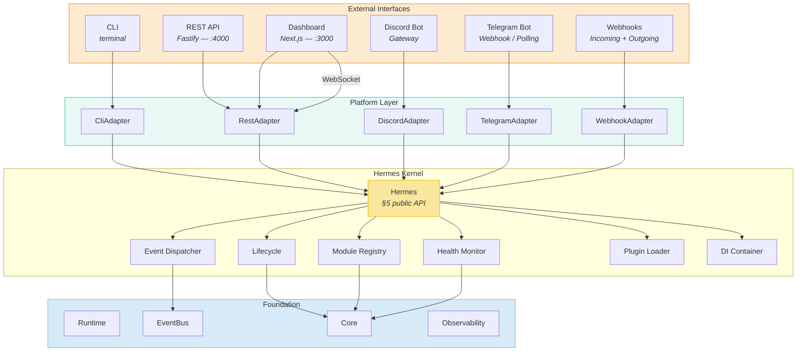
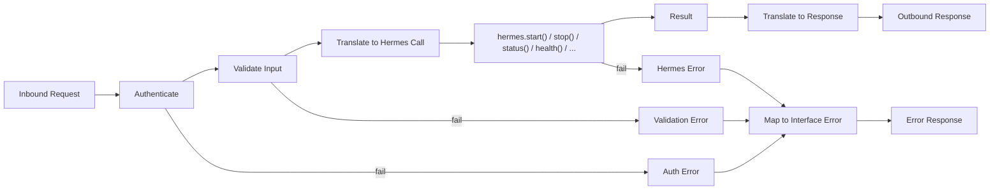
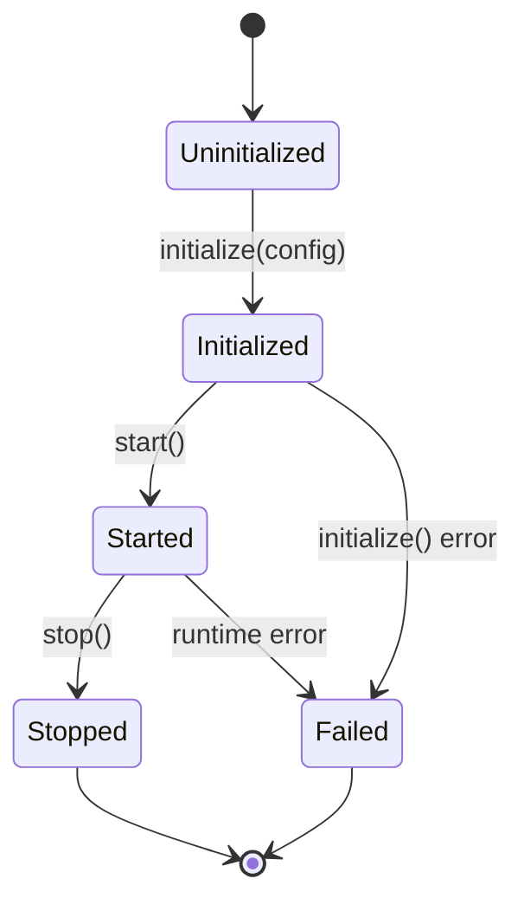
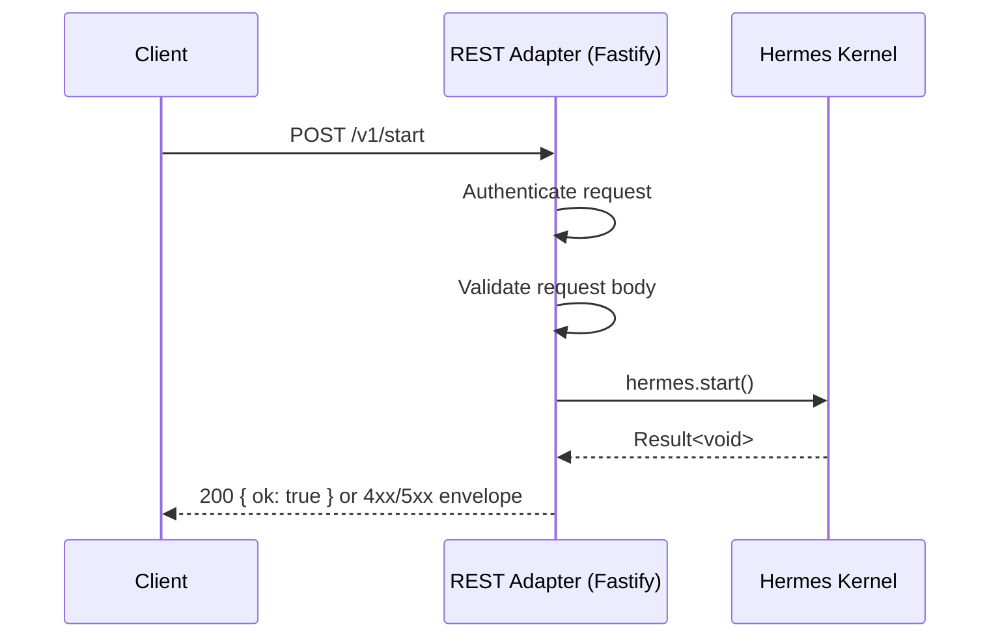
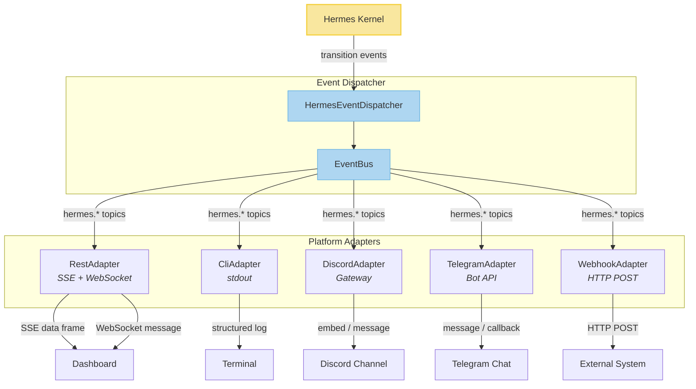
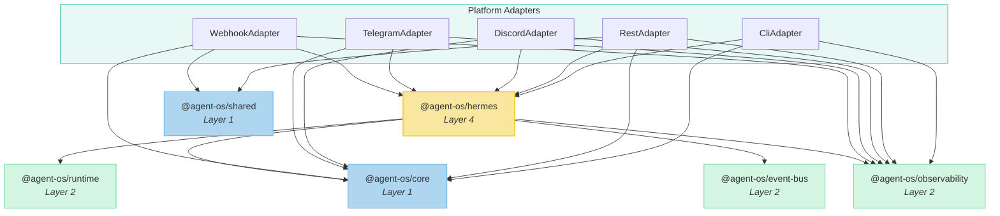
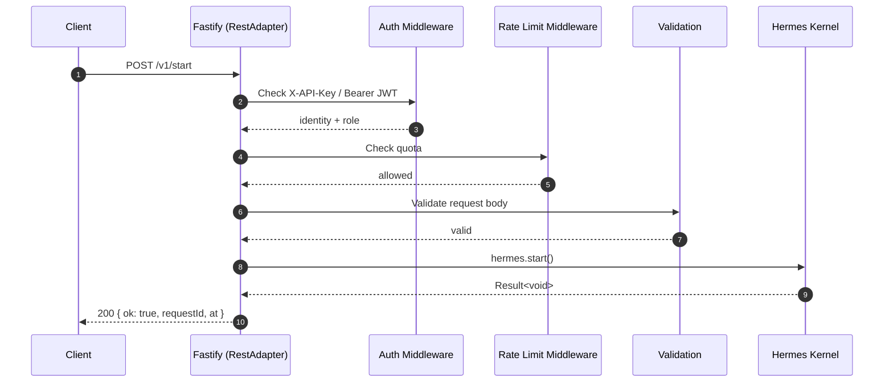
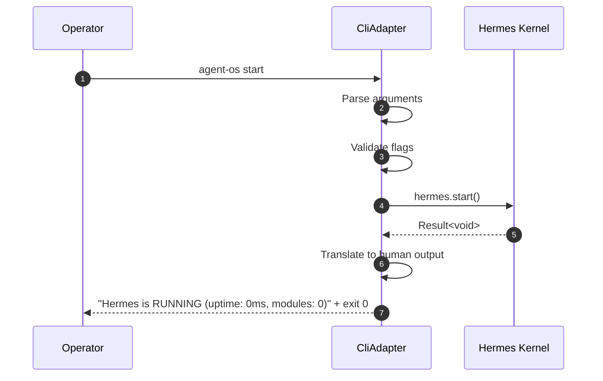

# Platform Architecture Specification

> This document is the **single source of truth** for every platform
> interface. No implementation code shall be written until this specification
> is complete and approved. Every adapter, route, command, and integration
> point must trace every decision back to a section of this document.
>
> This is an **architecture document**, not an implementation plan. It
> defines interfaces, responsibilities, boundaries, and data flow. It does
> not contain TypeScript, package configurations, or runtime code.

---

## 1. Purpose

### 1.1 What the Platform Layer Is

The Platform Layer is the set of adapters that translate external interfaces
into calls on the Hermes kernel and translate kernel responses back into
interface-specific representations. Every surface that a human, bot, or
external system uses to interact with Agent OS goes through exactly one
adapter in the Platform Layer.

Hermes remains the core. The Platform Layer adds no business logic, no
lifecycle state, no module state, no memory, and no workflow execution. It is
purely a translation and validation boundary.

### 1.2 Responsibilities

| Responsibility | Mechanism |
| --- | --- |
| Expose Hermes to operators | CLI adapter, REST API adapter |
| Expose Hermes to bots | Discord adapter, Telegram adapter |
| Expose Hermes to external systems | Webhook adapter |
| Expose Hermes to operators (visual) | Dashboard via REST + WebSocket |
| Validate input at the boundary | Each adapter validates before calling Hermes |
| Translate responses | Each adapter maps `Result<T>` / `HermesHealthMonitorReport` into its native format |
| Propagate errors | Map Hermes errors and adapter errors into interface-specific error envelopes |
| Authenticate callers | Per-adapter authentication (API keys, JWT, OAuth, signatures) |
| Rate-limit callers | Per-adapter rate limiting with shared back-off config |
| Correlate requests | Request IDs and correlation IDs injected at the adapter boundary |

### 1.3 Boundaries

```
                        ┌───────────────────────────────────────────────┐
   External             │              Platform Layer                   │
   Interfaces           │                                               │
                        │  ┌──────┐ ┌──────┐ ┌──────┐ ┌──────┐ ┌────┐ │
   CLI  ─────────────── │  │ CLI  │ │ REST │ │Discrd│ │Tlgrm│ │Hook│ │
   REST ─────────────── │  │      │ │ API  │ │      │ │     │ │    │ │
   Discord ──────────── │  │      │ │      │ │      │ │     │ │    │ │
   Telegram ─────────── │  │      │ │      │ │      │ │     │ │    │ │
   Webhooks ──────────  │  │      │ │      │ │       │ │     │ │    │ │
   Dashboard ────────── │  └──┬───┘ └──┬───┘ └──┬───┘ └──┬──┘ └─┬──┘ │
                        │     │       │        │       │      │    │
                        │     └───┬───┘────────┴───────┴──────┘    │
                        │         │     Shared Adapter Interface   │
                        │         ▼                                │
                        │  ┌──────────────┐                         │
                        │  │   Hermes     │  ◄── in-process call   │
                        │  │   Kernel     │                         │
                        │  └──────┬───────┘                         │
                        │         │                                │
                        └─────────┼────────────────────────────────┘
                                  ▼
                     ┌──────────────────────┐
                     │  Runtime / EventBus   │
                     │  Core / Observability │
                     └──────────────────────┘
```

- **Inbound.** All external requests cross the Platform Layer boundary and
  are translated into Hermes API calls.
- **Outbound.** All Hermes responses and events cross back through the
  Platform Layer and are translated into interface-specific representations.
- **No bypass.** No external interface may call Runtime, Core, EventBus, or
  Observability directly. Hermes is the sole gateway.

### 1.4 Design Goals

1. **Hermes is the core.** The Platform Layer never duplicates what Hermes
   owns (lifecycle, module registry, health aggregation, events, plugins).
2. **Adapters are stateless.** Each adapter holds no mutable domain state.
   State lives in Hermes; adapters translate and forward.
3. **One adapter per interface.** CLI, REST, Discord, Telegram, and
   Webhooks each have exactly one adapter. No shared-UI adapter; the
   Dashboard uses the REST and WebSocket adapters.
4. **Shared adapter contract.** Every adapter follows the same lifecycle
   (`initialize`, `start`, `stop`, `health`, `metadata`) so new adapters can
   be dropped in without changing Hermes.
5. **Fail-closed at the boundary.** Invalid input is rejected before it
   reaches Hermes. Auth failures return 401/403 before Hermes is called.
6. **Observable by default.** Every adapter emits structured logs with
   request IDs, correlation IDs, and trace spans inherited from
  `@agent-os/observability`.

### 1.5 Non-Goals

- The Platform Layer does **not** implement agent logic, memory retrieval,
  workflow execution, or model routing. Those are Hermes-registered modules.
- The Platform Layer does **not** own the Hermes lifecycle. It calls
  `hermes.start()` and `hermes.stop()`; it does not manage the phase state
  machine.
- The Platform Layer does **not** manage multi-tenant isolation. That is a
  future Hermes concern delivered via a module.
- The Platform Layer does **not** dictate UI design for the Dashboard. It
  specifies the REST, WebSocket, and event-stream endpoints the Dashboard
  consumes.
- The Platform Layer does **not** replace `apps/api`. The existing Fastify
  application becomes the REST API adapter within this architecture.

---

## 2. High-Level Architecture

### 2.1 Layered View

```
               ┌────────────────────────────────────────────────────────┐
  Users        │  CLI    REST API    Discord    Telegram    Webhooks     │
               └───────────────────────────┬────────────────────────────┘
                                           │
               ┌───────────────────────────┼────────────────────────────┐
  Platform     │       Platform Layer (Adapters)                        │
  Layer        │  CliAdapter  RestAdapter  DiscordAdapter  ...           │
               └───────────────────────────┼────────────────────────────┘
                                           │ Hermes public API (§5)
               ┌───────────────────────────┼────────────────────────────┐
  Kernel       │                 Hermes Kernel                           │
               │  Lifecycle  Registry  Health  Events  Plugins  DI     │
               └───────────────────────────┼────────────────────────────┘
                                           │
               ┌───────────────────────────┼────────────────────────────┐
  Foundation   │  Runtime    EventBus    Core    Observability           │
               └───────────────────────────────────────────────────────┘
```

### 2.2 Overall Architecture Diagram



### 2.3 Data Flow Summary

1. An external actor (user, bot, system) sends a request to one adapter.
2. The adapter authenticates and validates the request.
3. The adapter translates the request into a Hermes API call.
4. Hermes executes the call and returns a `Result<T>` or a typed report.
5. The adapter translates the result into the interface's native response.
6. If the call fails, the adapter maps the error into the interface's error
   format.

---

## 3. Adapter Architecture

### 3.1 Adapter Responsibilities

Every adapter MUST:

| Action | Description |
| --- | --- |
| Translate requests | Convert interface-native input into Hermes API arguments |
| Validate input | Reject malformed, unauthorized, or out-of-phase input before calling Hermes |
| Call Hermes | Invoke the appropriate Hermes method (`start`, `stop`, `status`, `health`, `registerModule`, `unregisterModule`) |
| Translate responses | Convert `Result<T>` and typed reports into interface-native output |
| Emit structured logs | Log every inbound request, outbound response, and error with request ID and correlation ID |
| Respect lifecycle | Refuse operations that are illegal in the current Hermes phase |

### 3.2 Adapter Prohibitions

Every adapter MUST NOT:

| Prohibition | Rationale |
| --- | --- |
| Implement business logic | Business logic belongs in Hermes-registered modules |
| Own lifecycle state | The phase is owned by `HermesLifecycle` only |
| Own module state | Module inventory is owned by `HermesModuleRegistry` only |
| Own memory | Memory is a future Hermes-registered module |
| Own workflow execution | Workflows are a future Hermes-registered module |
| Call foundation packages directly | All calls go through the Hermes public API (§5) |
| Hold mutable domain state | Adapters are stateless translators |
| Bypass authentication | Every request must be authenticated at the adapter boundary |

### 3.3 Adapter Composition



---

## 4. Shared Adapter Interface

Every adapter in the Platform Layer implements a common lifecycle interface.
This allows the Bootstrap (or a future adapter manager) to initialise, start,
stop, and health-check every adapter uniformly.

### 4.1 Interface Definition

```
Adapter
├── initialize(config: AdapterConfig): Promise<Result<void>>
├── start(): Promise<Result<void>>
├── stop(): Promise<Result<void>>
├── health(): Promise<AdapterHealth>
└── metadata(): AdapterMetadata
```

| Method | Description |
| --- | --- |
| `initialize(config)` | Read adapter-specific configuration, validate it, acquire any external resources (SDK clients, webhook URLs). Must succeed before `start()`. |
| `start()` | Begin accepting requests. For REST, this means the Fastify server listens. For CLI, this means the command parser is ready. For bots, this means the gateway connection is open. |
| `stop()` | Stop accepting new requests, drain in-flight requests, close external connections. Must resolve within `HERMES_SHUTDOWN_TIMEOUT_MS`. |
| `health()` | Return the adapter's own health status. Does NOT call `hermes.health()` — that is the kernel's health. The adapter health reports whether the adapter itself is functional (e.g., gateway connected, port bound). |
| `metadata()` | Return adapter identity: name, version, interface type, supported commands/operations. |

### 4.2 AdapterHealth Shape

```
AdapterHealth
├── status: 'healthy' | 'degraded' | 'failed' | 'unknown'
├── detail?: string
└── at: Timestamp
```

### 4.3 AdapterMetadata Shape

```
AdapterMetadata
├── name: string              // e.g. 'rest-api', 'cli', 'discord'
├── version: string           // semver
├── interfaceType: string     // 'cli' | 'rest' | 'discord' | 'telegram' | 'webhook'
└── supportedOperations: string[]  // e.g. ['start', 'stop', 'status', 'health']
```

### 4.4 Adapter Lifecycle

Adapters follow the same phase-based lifecycle as Hermes. An adapter may only
start after Hermes has transitionsed to `RUNNING`. An adapter must stop when
Hermes transitions to `STOPPING`.



### 4.5 Phase Gating

| Adapter Method | Required Hermes Phase | Behaviour if phase is wrong |
| --- | --- | --- |
| `initialize()` | Any | Always allowed |
| `start()` | `RUNNING` | Return error if Hermes is not `RUNNING` |
| `stop()` | Any non-terminal | Always allowed (idempotent) |
| `health()` | Any | Always allowed |
| `metadata()` | Any | Always allowed |

---

## 5. CLI Architecture

### 5.1 Command Hierarchy

```
agent-os
├── start           Start the Hermes kernel
├── stop             Stop the Hermes kernel
├── status           Show kernel phase, uptime, module count
├── health           Show aggregate and per-module health
├── plugins          Plugin management subcommands
│   ├── list         List registered plugins
│   ├── load <dir>   Load plugins from a directory
│   └── unload <n>   Unload a named plugin
├── config           Show active configuration (secrets redacted)
└── version          Show CLI and kernel version
```

### 5.2 Command Parsing

- Parse `process.argv` using a dedicated argument parser (not a third-party
  framework — the command set is small and fixed).
- The first positional argument determines the command.
- Flags are long-form only (`--json`, `--timeout`, `--help`).
- `--json` forces JSON output on all commands that produce structured data.
- `--help` on any command prints usage and exits.

### 5.3 Exit Codes

| Code | Meaning |
| --- | --- |
| `0` | Success |
| `1` | General error (Hermes returned an error, validation failed) |
| `2` | Usage error (unknown command, missing required argument) |
| `3` | Auth error (API key missing or invalid when calling REST adapter) |
| `4` | Phase error (operation not legal in current Hermes phase) |
| `5` | Timeout (operation did not complete within deadline) |
| `6` | Signal (process received SIGTERM/SIGINT during operation) |

### 5.4 Output Conventions

| Stream | Content |
| --- | --- |
| `stdout` | Structured output (human-readable table by default; JSON if `--json`) |
| `stderr` | Diagnostic messages, warnings, error explanations |
| Exit code | Machine-readable success/failure (see §5.3) |

Human-readable output uses tabular format. JSON output uses the same schema as
the REST API response envelope (see §6.5).

### 5.5 Interactive Mode

- When `stdin` is a TTY and no command is provided, the CLI enters
  interactive mode.
- Interactive mode presents a REPL with command auto-completion.
- Each line is parsed as a CLI command.
- `exit` or `Ctrl-D` terminates the REPL and stops the process.

### 5.6 Non-Interactive Mode

- When a command is provided as an argument, it runs once and exits.
- When `stdin` is not a TTY (piped input), the CLI reads newline-delimited
  JSON commands from stdin (one command per line) and emits newline-delimited
  JSON responses to stdout.

### 5.7 Command Details

#### `start`

- Calls `hermes.start()`.
- On success, prints phase and exits `0`.
- On failure, prints error and exits `1`.
- `--timeout <ms>` — maximum time to wait for `RUNNING` (default: 30000).
- `--json` — print JSON result.

#### `stop`

- Calls `hermes.stop()`.
- On success, prints `STOPPED` and exits `0`.
- On failure, prints error and exits `1`.
- `--timeout <ms>` — maximum time to wait for `STOPPED` (default: 30000).
- `--json` — print JSON result.

#### `status`

- Calls `hermes.status()`.
- Always exits `0` (status is a pure read, never fails).
- Prints `{ phase, uptime, modules }` in tabular or JSON format.

#### `health`

- Calls `hermes.health()`.
- Exits `0` if aggregate status is `healthy` or `degraded`.
- Exits `1` if aggregate status is `failed`.
- Exits `1` if aggregate status is `unknown` (no modules registered or
  still in `INITIALIZING`).

#### `plugins`

- `plugins list` — reads `hermes.status().modules` and the module registry
  snapshot to list registered module names.
- `plugins load <dir>` — invokes the Plugin Loader via Hermes API.
- `plugins unload <name>` — calls `hermes.unregisterModule(name)`.

#### `config`

- Reads `hermes.config` (the frozen `HermesConfig` from §2.2).
- Prints all config keys with secrets redacted (`****`).
- `--json` — print as JSON.

#### `version`

- Prints CLI version, Hermes kernel version, and API version.
- No Hermes call required — versions are static constants.

---

## 6. REST API Architecture

### 6.1 Versioning

- All routes are prefixed with `/v1`.
- Future breaking changes introduce `/v2`.
- The version prefix is part of the URL path, not a header.

### 6.2 Routing

```
/v1
├── /start                POST    Start the Hermes kernel
├── /stop                 POST    Stop the Hermes kernel
├── /status               GET     Read kernel status
├── /health               GET     Read aggregate health
├── /health/modules       GET     Read per-module health
├── /modules              GET     List registered modules
├── /modules/:name        GET     Get a single module
├── /modules              POST    Register a module
├── /modules/:name        DELETE  Unregister a module
├── /config               GET     Read active config (redacted)
├── /version              GET     Read service version
└── /events               GET     SSE stream of Hermes events
```

### 6.3 Request Flow



### 6.4 Request / Response Lifecycle

1. Fastify receives the HTTP request.
2. CORS and Helmet middleware are applied (existing `apps/api` scaffolding).
3. Auth middleware validates the API key or JWT.
4. Rate-limit middleware checks the caller's quota.
5. Request validation (Fastify schema or Zod) runs.
6. The route handler translates the validated input into a Hermes call.
7. Hermes executes and returns a `Result<T>`.
8. The route handler translates the result into the response envelope.
9. Structured logging records the request ID, correlation ID, status code,
   and latency.

### 6.5 Response Envelope

Every response uses a consistent envelope:

```
Success:
{
  "ok": true,
  "data": <T>,
  "requestId": "<uuid>",
  "at": "<ISO-8601>"
}

Error:
{
  "ok": false,
  "error": {
    "code": "<string>",
    "message": "<human-readable>",
    "detail?": "<additional context>"
  },
  "requestId": "<uuid>",
  "at": "<ISO-8601>"
}
```

### 6.6 Error Envelope Codes

| HTTP Status | Error Code | When |
| --- | --- | --- |
| `400` | `VALIDATION_ERROR` | Request body or query params fail schema validation |
| `401` | `AUTH_MISSING` | No API key or JWT provided |
| `403` | `AUTH_FORBIDDEN` | API key or JWT is invalid or expired |
| `404` | `NOT_FOUND` | Resource does not exist (module name, route) |
| `409` | `PHASE_CONFLICT` | Operation is not legal in the current Hermes phase |
| `429` | `RATE_LIMITED` | Caller has exceeded rate limit |
| `500` | `HERMES_ERROR` | Hermes returned an error |
| `503` | `SERVICE_UNAVAILABLE` | Adapter or Hermes is not `RUNNING` |

### 6.7 Authentication Boundary

- The REST API uses **API keys** for machine-to-machine communication.
- The REST API uses **JWT** for dashboard and human operator sessions.
- API keys are validated in Fastify middleware before any route handler runs.
- JWTs are validated in Fastify middleware; expired tokens return `401`.
- The auth boundary is the **first middleware** after CORS and Helmet.
- No route handler ever sees an unauthenticated request.

### 6.8 Streaming Strategy

#### Server-Sent Events (SSE)

- `GET /v1/events` streams Hermes lifecycle and module events to connected
  clients using SSE.
- The adapter subscribes to the EventBus via `HermesEventDispatcher` topics
  and translates each event envelope into an SSE `data:` frame.
- Event format:

  ```
  event: hermes.started
  data: {"phase":"RUNNING","modules":3,"at":"2026-06-28T12:00:00.000Z"}

  event: hermes.module.registered
  data: {"name":"memory-gateway","version":"1.0.0","at":"2026-06-28T12:00:01.000Z"}
  ```

- Clients reconnect with `Last-Event-ID` for resume.
- The SSE connection is read-only; clients cannot send events through SSE.

#### WebSocket

- `ws://<host>:4000/v1/ws` provides a bidirectional WebSocket for the
  Dashboard.
- Incoming messages follow the same JSON envelope as REST requests.
- Outgoing messages are event envelopes identical to SSE format.
- The WebSocket adapter shares the same auth middleware as REST (first
  message must carry an API key or JWT).

---

## 7. Discord Architecture

### 7.1 Gateway Events

The Discord adapter connects to the Discord Gateway (v10) via WebSocket and
listens for the following events:

| Gateway Event | Adapter Action |
| --- | --- |
| `INTERACTION_CREATE` | Route to slash command handler |
| `MESSAGE_CREATE` | Route to message handler (if prefixed) |
| `READY` | Mark adapter health as `healthy` |
| `RESUMED` | Log resume; no action |
| `GUILD_UNAVAILABLE` | Mark adapter health as `degraded` |

### 7.2 Slash Commands

| Command | Hermes Call | Description |
| --- | --- | --- |
| `/agent-os start` | `hermes.start()` | Start the kernel |
| `/agent-os stop` | `hermes.stop()` | Stop the kernel |
| `/agent-os status` | `hermes.status()` | Show phase, uptime, modules |
| `/agent-os health` | `hermes.health()` | Show aggregate health |
| `/agent-os plugins` | `hermes.status().modules` | List registered modules |
| `/agent-os config` | `hermes.config` | Show config (secrets redacted) |
| `/agent-os version` | static | Show version |

### 7.3 Message Handling

- The adapter ignores messages that do not mention or prefix the bot.
- Mention-prefixed messages (`@AgentOS status`) are parsed as commands.
- Unknown commands receive an ephemeral "Unknown command" response.
- Long-running operations (start, stop) respond with a deferred message that
  is updated when the operation completes.

### 7.4 Permissions

- The adapter reads the Discord guild role configuration at startup.
- Only users with the configured admin role may call `start` and `stop`.
- All guild members may call `status`, `health`, `plugins`, `config`,
  `version`.
- Permission checks happen in the adapter before the Hermes call.

### 7.5 Interaction Lifecycle

1. Discord sends `INTERACTION_CREATE` to the adapter.
2. The adapter validates the sender's permissions.
3. The adapter maps the slash command to a Hermes API call.
4. The adapter calls `interaction.defer()` if the call is long-running.
5. Hermes returns a `Result<T>`.
6. The adapter translates the result into a Discord embed or message.
7. The adapter calls `interaction.editReply()` or `interaction.reply()`.

---

## 8. Telegram Architecture

### 8.1 Modes

The Telegram adapter supports two modes, configurable at initialization:

| Mode | Mechanism | When to use |
| --- | --- | --- |
| **Webhook** | Telegram sends POST to `<PUBLIC_URL>/v1/adapters/telegram/webhook` | Production — requires a public URL and TLS |
| **Polling** | Adapter polls `getUpdates` on a timer | Development — no public URL required |

Only one mode may be active at a time. The adapter selects the mode during
`initialize()` based on whether `TELEGRAM_WEBHOOK_URL` is configured.

### 8.2 Commands

| Command | Hermes Call | Description |
| --- | --- | --- |
| `/start` | — (ignored) | Telegram default; no action |
| `/agent_os_start` | `hermes.start()` | Start the kernel |
| `/agent_os_stop` | `hermes.stop()` | Stop the kernel |
| `/agent_os_status` | `hermes.status()` | Show phase, uptime, modules |
| `/agent_os_health` | `hermes.health()` | Show aggregate health |
| `/agent_os_plugins` | `hermes.status().modules` | List registered modules |
| `/agent_os_config` | `hermes.config` | Show config (redacted) |
| `/agent_os_version` | static | Show version |

### 8.3 Callback Buttons

- Interactive messages use Telegram inline keyboards.
- Buttons map to Hermes API calls (e.g., a "Stop" button invokes
  `hermes.stop()`).
- Callback queries are answered with `answerCallbackQuery` to dismiss the
  loading indicator.

### 8.4 Permissions

- The adapter reads `TELEGRAM_ADMIN_IDS` (comma-separated user IDs) at
  initialization.
- Only admin users may call `agent_os_start` and `agent_os_stop`.
- All users may call read-only commands.
- Group chats: the adapter only responds to admin users for mutating
  commands; read-only commands respond to anyone.

---

## 9. Webhook Architecture

### 9.1 Incoming Webhooks

- External systems POST to `POST /v1/webhooks/:source`.
- The adapter validates the webhook signature (see §11.5).
- The adapter maps the webhook payload to a Hermes event or command.
- Supported sources are registered at adapter initialization; unknown sources
  return `404`.
- Each source has a dedicated payload mapping (not generic — each external
  system has a schema).

### 9.2 Outgoing Webhooks

- Hermes events can be forwarded to external systems via outgoing webhooks.
- An outgoing webhook is registered with:
  - `targetUrl`: the URL to POST to.
  - `topics`: a list of Hermes event topics to subscribe to.
  - `secret`: a shared secret for signing outgoing payloads.
  - `headers`: optional additional HTTP headers.
- The adapter subscribes to EventBus topics and, on each event, POSTs the
  event payload to the target URL.
- Retries follow the policy in §9.3.

### 9.3 Retry Policy

| Attempt | Delay |
| --- | --- |
| 1 | Immediate |
| 2 | 1 second |
| 3 | 5 seconds |
| 4 | 30 seconds |

- After 4 failed attempts, the webhook is marked `failed` and the adapter
  emits a `webhook.delivery.failed` event.
- Retries use exponential back-off with jitter.
- The adapter does NOT retry on 4xx responses (client errors are permanent).
- Only 5xx and network errors trigger retries.

### 9.4 Signature Validation

- Incoming webhooks: the adapter validates `X-Webhook-Signature` (HMAC-SHA256
  of the raw body using the per-source shared secret).
- Outgoing webhooks: the adapter signs the payload body with HMAC-SHA256 and
  sets `X-AgentOS-Signature` on the outgoing request.
- Timestamp validation: reject webhook signatures older than 5 minutes to
  prevent replay attacks.

### 9.5 Event Mapping

| Hermes Event | Outgoing Webhook Payload |
| --- | --- |
| `hermes.started` | `{ "event": "hermes.started", "phase": "RUNNING", "modules": N, "at": "<ISO>" }` |
| `hermes.stopping` | `{ "event": "hermes.stopping", "phase": "STOPPING", "reason": "...", "at": "<ISO>" }` |
| `hermes.stopped` | `{ "event": "hermes.stopped", "phase": "STOPPED", "at": "<ISO>" }` |
| `hermes.failed` | `{ "event": "hermes.failed", "phase": "FAILED", "reason": "...", "at": "<ISO>" }` |
| `hermes.module.registered` | `{ "event": "hermes.module.registered", "name": "...", "at": "<ISO>" }` |
| `hermes.module.unregistered` | `{ "event": "hermes.module.unregistered", "name": "...", "at": "<ISO>" }` |

---

## 10. Dashboard Integration

### 10.1 Architecture

The Dashboard (`apps/dashboard`) is a **consumer** of the Platform Layer; it
is NOT an adapter. It communicates with Hermes exclusively through the REST
API adapter and the WebSocket adapter. The Dashboard never imports from
`@agent-os/hermes` directly.

```
Dashboard (Next.js)
     │
     ├── REST ──── RestAdapter ──── Hermes
     │
     ├── WebSocket ── RestAdapter ── Hermes
     │
     └── SSE ─────── RestAdapter ── EventBus
```

### 10.2 REST Endpoints Used by Dashboard

| Endpoint | Dashboard Use |
| --- | --- |
| `GET /v1/status` | Show kernel phase, uptime, module count |
| `GET /v1/health` | Show health grid |
| `GET /v1/health/modules` | Show per-module health cards |
| `GET /v1/modules` | Show module list |
| `POST /v1/start` | Start button |
| `POST /v1/stop` | Stop button |
| `GET /v1/config` | Configuration display |
| `GET /v1/version` | Version footer |

### 10.3 WebSocket

- The Dashboard connects to `ws://<host>:4000/v1/ws` on mount.
- The WebSocket pushes real-time Hermes events to the Dashboard.
- Event types: `hermes.started`, `hermes.stopping`, `hermes.stopped`,
  `hermes.failed`, `hermes.module.registered`, `hermes.module.unregistered`,
  `hermes.module.failed`.
- The Dashboard uses these events to update its UI without polling.

### 10.4 Event Stream (SSE)

- `GET /v1/events` is available as a lighter-weight alternative to WebSocket.
- The Dashboard may use SSE for read-only event streaming where WebSocket is
  unavailable.
- SSE events arrive in the same envelope as WebSocket messages.

### 10.5 No Direct Hermes Access

- The Dashboard MUST NOT import `@agent-os/hermes`.
- The Dashboard MUST NOT import `@agent-os/runtime`, `@agent-os/event-bus`,
  or `@agent-os/observability`.
- All data flows through the REST API adapter.
- Per the existing dependency rules (ADR-003), `apps/dashboard` may only
  depend on `core`, `shared`, and `ui`.

---

## 11. Authentication

### 11.1 Overview

Each adapter authenticates callers using the mechanism appropriate to its
interface. Authentication happens at the adapter boundary — before any Hermes
call is made.

### 11.2 API Keys

- Used for machine-to-machine access to the REST API and incoming webhooks.
- Stored as `AGENT_OS_API_KEYS` (comma-separated list of SHA-256 hashes of
  the key values).
- Request header: `X-API-Key: <key>`.
- The adapter hashes the provided key and compares it to the stored hashes.
- Keys are not stored in plaintext; only hashes are compared.

### 11.3 JWT

- Used for dashboard and human operator sessions.
- Signed with `AGENT_OS_JWT_SECRET` (HMAC-SHA256).
- Token header: `Authorization: Bearer <jwt>`.
- Claims: `{ sub: string, role: 'admin' | 'viewer', iat, exp }`.
- `admin` role: full access (start, stop, register, unregister).
- `viewer` role: read-only access (status, health, config, version).
- Token expiry: 1 hour (configurable).

### 11.4 Discord OAuth

- Discord bot interactions are authenticated by the Discord Gateway
  signature. The adapter validates the `X-Signature-Ed25519` header on
  incoming interactions.
- User-level permissions are enforced by the adapter (see §7.4).

### 11.5 Telegram Validation

- Telegram Bot API authentication uses the `hash` field in Telegram
  `initData`. The adapter computes HMAC-SHA256 of the data-check string with
  the bot token as the key and compares the resulting hash.
- Admin user IDs are validated against `TELEGRAM_ADMIN_IDS`.

### 11.6 Webhook Signatures

- See §9.4 for signature validation details.

### 11.7 Auth Mapping to Hermes

| Authenticated Identity | Hermes Permission |
| --- | --- |
| API key (admin) | Full access |
| API key (viewer) | Read-only |
| JWT (admin) | Full access |
| JWT (viewer) | Read-only |
| Discord admin role | Full access |
| Discord member | Read-only |
| Telegram admin user | Full access |
| Telegram user | Read-only |
| Valid webhook signature | Mapped source-specific permissions |

Full access: `start`, `stop`, `status`, `health`, `registerModule`,
`unregisterModule`, `config`, `version`.

Read-only: `status`, `health`, `config`, `version`.

---

## 12. Error Handling

### 12.1 Error Propagation

```
Hermes Error → Adapter → Interface Error
```

Hermes errors are `Result<T>` values where `ok: false` and `error: Error`.
Adapters must never throw; they always catch and translate.

### 12.2 Adapter Errors

| Error Category | Source | Example |
| --- | --- | --- |
| Validation error | Adapter input validation | Missing required field, invalid format |
| Auth error | Adapter auth middleware | Invalid API key, expired JWT |
| Phase conflict | Hermes phase guard | `start()` called when already `RUNNING` |
| Rate limit | Adapter rate limiter | Too many requests |
| Internal error | Unexpected adapter failure | Uncaught exception in adapter code |

### 12.3 Hermes Errors

| Hermes Error | Meaning | Adapter Mapping |
| --- | --- | --- |
| `Result.ok: false` with `Error` message | Hermes rejected the operation | Map to interface error with `HERMES_ERROR` code |
| Phase guard throws | Operation not legal in current phase | Map to `PHASE_CONFLICT` / exit code 4 |
| Module not found | `unregisterModule` on unknown name | Map to `NOT_FOUND` |
| Dependency not met | `registerModule` with missing deps | Map to `VALIDATION_ERROR` |

### 12.4 HTTP Error Responses

- All HTTP error responses use the error envelope (§6.6).
- HTTP status codes are set by the adapter, not by Hermes.
- 5xx errors include a request ID for support correlation.

### 12.5 CLI Exit Codes

See §5.3 for the full exit code table.

### 12.6 Discord / Telegram Error Rendering

- Errors are rendered as human-readable messages (embeds for Discord,
  markdown for Telegram).
- Internal error details are NOT exposed to end users — only the error code
  and a generic message.
- Full error details are logged with the request ID for operator review.

---

## 13. Logging

### 13.1 Structured Logging

- Every log entry is JSON with the following fields:

```
{
  "timestamp": "<ISO-8601>",
  "level": "trace" | "debug" | "info" | "warn" | "error" | "fatal",
  "message": "<human-readable>",
  "adapter": "<adapter name>",
  "requestId": "<uuid>",
  "correlationId": "<uuid>",
  "traceId?": "<OTel trace ID>",
  "spanId?": "<OTel span ID>",
  "durationMs?": <number>,
  "phase?": "<Hermes lifecycle phase>",
  ...additional context fields
}
```

### 13.2 Request IDs

- Every inbound request is assigned a UUID v4 request ID at the adapter
  boundary.
- The request ID propagates through all log entries for that request.
- The request ID is returned to the caller in the response envelope
  (`requestId` field).
- Request IDs are NOT propagated into Hermes — Hermes is request-id-agnostic.

### 13.3 Correlation IDs

- A correlation ID ties a sequence of related requests together (e.g., a
  Discord slash command that triggers a Hermes start, then a health check).
- If the caller supplies `X-Correlation-ID`, the adapter uses it.
- If not supplied, the adapter generates a UUID v4 correlation ID.
- Correlation IDs are included in all log entries for the request chain.

### 13.4 Tracing

- Each adapter creates an OpenTelemetry span for the inbound request.
- The span inherits the trace context from the caller (if provided via
  `traceparent` header).
- Hermes-internal operations create child spans via
  `@agent-os/observability`.
- Span names follow the convention: `<adapter>.<operation>` (e.g.,
  `rest.start`, `discord.health`).

---

## 14. Event Flow

### 14.1 Event Direction

Events flow outward from Hermes to adapters. Adapters do not emit events
into Hermes — they call the Hermes API.

```
Hermes Kernel
    │
    ▼
Event Dispatcher (bridges to EventBus)
    │
    ├──► RestAdapter ──── SSE / WebSocket ──── Dashboard
    │                                         Clients
    ├──► DiscordAdapter ── Discord Gateway ── Discord Channel
    ├──► TelegramAdapter ─ Bot API ──────── Telegram Chat
    ├──► WebhookAdapter ── HTTP POST ────── External Systems
    └──► CliAdapter ────── stdout ──────── Terminal
```

### 14.2 Event Flow Diagram



### 14.3 Subscription Model

- Each adapter subscribes to the Hermes event topics it cares about at
  `start()` time.
- Subscriptions use `EventBus.subscribe()` and return `SubscriptionId`.
- At `stop()` time, each adapter calls `EventBus.unsubscribe()` for all
  subscribed topics.
- The Event Dispatcher (§2.6 of hermes.md) bridges lifecycle transitions to
  event bus publications. Adapters never need to know about the Lifecycle
  Manager directly.

### 14.4 Best-Effort Delivery

- Per §6.3 of the Hermes architecture, events are emitted on a best-effort
  basis. If an adapter's event handler throws, the error is logged but does
  not affect the Hermes transition.
- Adapters must not rely on event ordering for correctness.
- Adapters must not use events as a replacement for Hermes API calls. Events
  are **notifications**, not commands.

---

## 15. Security

### 15.1 Trust Boundaries

```
┌─────────────────────────────────────────────────────────┐
│  Untrusted Zone                                         │
│  CLI input, HTTP requests, Discord messages,            │
│  Telegram messages, incoming webhook payloads           │
└───────────────────────┬─────────────────────────────────┘
                        │  Authentication + Validation
                        ▼
┌─────────────────────────────────────────────────────────┐
│  Platform Layer (Adapters)                             │
│  Input validation, auth enforcement, rate limiting      │
└───────────────────────┬─────────────────────────────────┘
                        │  Typed Hermes API calls
                        ▼
┌─────────────────────────────────────────────────────────┐
│  Trusted Zone                                          │
│  Hermes Kernel, Runtime, EventBus, Core, Observability │
└─────────────────────────────────────────────────────────┘
```

### 15.2 Rate Limiting

- Rate limits are enforced per adapter, per authenticated identity.
- Default: 60 requests per minute per identity.
- Admin identities: 300 requests per minute.
- Rate limit headers:

  | Header | Meaning |
  | --- | --- |
  | `X-RateLimit-Limit` | Maximum requests per window |
  | `X-RateLimit-Remaining` | Remaining requests in current window |
  | `X-RateLimit-Reset` | Seconds until the window resets |

- When rate-limited, the adapter returns `429 Too Many Requests` with a
  `Retry-After` header.

### 15.3 Permissions

- See §11.7 for the auth-to-permission mapping.
- Mutating operations (`start`, `stop`, `registerModule`, `unregisterModule`)
  require admin-level access.
- Read-only operations (`status`, `health`, `config`, `version`) require
  viewer-level access (minimum).

### 15.4 Secrets

- Secrets are never logged, never included in response payloads, and never
  exposed through the `config` endpoint (redacted as `****`).
- Secrets are read from environment variables at `initialize()` time.
- Required secrets:

  | Secret | Used By |
  | --- | --- |
  | `AGENT_OS_API_KEYS` | REST API, Webhook adapter |
  | `AGENT_OS_JWT_SECRET` | REST API, Dashboard |
  | `DISCORD_BOT_TOKEN` | Discord adapter |
  | `TELEGRAM_BOT_TOKEN` | Telegram adapter |
  | `WEBHOOK_SECRET_<SOURCE>` | Incoming webhook validation |
  | `OPENROUTER_API_KEY` | Hermes Config (§2.2) |

### 15.5 Validation

- All adapter input is validated before any Hermes call.
- Validation uses Zod schemas (consistent with ADR-002 and existing
  `HermesConfig` patterns).
- Validation errors return the first error with a human-readable message;
  full Zod error details are available in structured logs only.
- No user-supplied data is passed through to Hermes without validation.

---

## 16. Scalability

### 16.1 Horizontal Scaling

- Adapters are stateless. No adapter holds mutable domain state.
- REST API adapter: horizontally scalable behind a load balancer. WebSocket
  connections require sticky sessions (or a pub/sub bridge via EventBus).
- SSE connections: horizontally scalable if the EventBus supports fan-out
  (Redis Streams do).
- Discord and Telegram adapters: single-instance only (platform limitation —
  one gateway connection per bot token).
- Webhook adapter: horizontally scalable behind a load balancer.

### 16.2 Stateless Adapters

- No adapter holds session state between requests.
- Auth state (JWT verification) is stateless — verified per-request using the
  `JWT_SECRET`.
- Rate-limit counters are stored in Redis (external, shared state), not in
  adapter memory.
- This allows any REST adapter instance to serve any request.

### 16.3 Multiple Hermes Instances

- In a clustered deployment, each Hermes instance runs within a single API
  process.
- Multiple API processes can run behind a load balancer, each with its own
  Hermes instance.
- Module registration is per-Hermes (not shared across instances).
- For stateful modules (e.g., future workflow engine), a shared Redis-backed
  queue coordinates work across instances.

### 16.4 Clustering

- The REST API adapter supports Node.js cluster mode for multi-core
  machines.
- The Discord and Telegram adapters run as single-threaded processes (platform
  limitation).
- The CLI adapter is single-use (one command per invocation).

---

## 17. Future Integrations

The following integrations are **reserved** — they are named here so the
architecture can accommodate them, but they are **not implemented** and must
not appear in any source tree until their own specifications are written and
approved.

### 17.1 Slack

- **Interface type:** `slack`
- **Mechanism:** Slack Bolt SDK (WebSocket mode or HTTP mode).
- **Commands:** Slash commands mapped to Hermes API calls.
- **Permissions:** Slack workspace admin role.
- **Priority:** Phase 4.

### 17.2 Microsoft Teams

- **Interface type:** `teams`
- **Mechanism:** Bot Framework SDK.
- **Commands:** Adaptive cards and message extensions.
- **Permissions:** Microsoft Entra ID (Azure AD) group membership.
- **Priority:** Phase 4.

### 17.3 WhatsApp

- **Interface type:** `whatsapp`
- **Mechanism:** WhatsApp Business API (webhook mode).
- **Commands:** Text-based command parser.
- **Permissions:** Phone number allow-list.
- **Priority:** Phase 5.

### 17.4 Email

- **Interface type:** `email`
- **Mechanism:** IMAP polling or SES webhook.
- **Commands:** Subject-line commands parsed from inbound emails.
- **Permissions:** Sender allow-list.
- **Priority:** Phase 5.

### 17.5 GitHub

- **Interface type:** `github`
- **Mechanism:** GitHub App webhooks.
- **Commands:** Issue/PR comment commands (`/agent-os status`).
- **Permissions:** Repository collaborator status.
- **Priority:** Phase 4.

### 17.6 GitLab

- **Interface type:** `gitlab`
- **Mechanism:** GitLab webhook integration.
- **Commands:** Same as GitHub.
- **Permissions:** Project member status.
- **Priority:** Phase 4.

### 17.7 VS Code

- **Interface type:** `vscode`
- **Mechanism:** VS Code extension API.
- **Commands:** Command palette entries.
- **Permissions:** Local-only (extension runs in the user's machine).
- **Priority:** Phase 3.

### 17.8 Model Context Protocol (MCP)

- **Interface type:** `mcp`
- **Mechanism:** MCP server exposing Hermes operations as MCP tools.
- **Commands:** Tool calls: `hermes_start`, `hermes_stop`, `hermes_status`,
  `hermes_health`.
- **Permissions:** Delegated to the MCP client's auth.
- **Priority:** Phase 3.

### 17.9 OpenAI Agents SDK

- **Interface type:** `openai-agents`
- **Mechanism:** Function-calling interface exposed as OpenAI-compatible tools.
- **Commands:** Function calls mapped to Hermes API.
- **Permissions:** API key (delegated).
- **Priority:** Phase 3.

---

## 18. Design Principles

### 18.1 Single Responsibility

Each adapter has one reason to change: a change in the external interface it
wraps. Hermes changes do not affect adapters (except when the Hermes public API
changes, which requires a versioned migration per §6.1).

### 18.2 Dependency Inversion

Adapters depend on the Hermes interface (abstraction), not on Hermes internals.
The Hermes public API (§5) is the port; each adapter is an adapter for that
port into a specific interface technology.

### 18.3 Composition over Inheritance

Adapters do not inherit from a base class. They compose the shared adapter
lifecycle by implementing the `Adapter` interface (§4.1). Shared behaviour
(auth, rate limiting, logging) is extracted into composable middleware, not
into an inheritance hierarchy.

### 18.4 Adapter Pattern

Each adapter follows the classic Adapter pattern:

```
External Interface ←→ Adapter ←→ Hermes Interface
    (Discord)         (DiscordAdapter)  (hermes.start / stop / status / ...)
```

The adapter wraps the Hermes interface and presents it in the target
interface's native format.

### 18.5 Ports and Adapters

The Platform Layer implements the **Ports and Adapters** (Hexagonal)
architecture. Hermes defines the ports (the §5 public API). Each adapter
is a primary adapter (driving side) that translates external input into
port calls. The EventBus subscription mechanism is the secondary port
(driven side) that pushes data out to adapters.

### 18.6 Event-Driven Integration

Adapters integrate with Hermes through two mechanisms:

1. **Synchronous calls.** The adapter calls a Hermes method and waits for a
   `Result<T>`.
2. **Asynchronous events.** The adapter subscribes to EventBus topics and
   reacts to Hermes state changes without polling.

This dual mechanism allows adapters to provide both request-response
semantics (REST, CLI) and push-based semantics (Discord, Telegram, Dashboard
WebSocket).

---

## 19. Dependency Rules

### 19.1 Allowed Dependencies

| Component | May depend on |
| --- | --- |
| Any adapter | `@agent-os/hermes` (public API only), `@agent-os/core`, `@agent-os/observability` |
| REST API adapter | `@agent-os/hermes`, `@agent-os/core`, `@agent-os/shared`, `@agent-os/observability`, `fastify` and `@fastify/*` |
| CLI adapter | `@agent-os/hermes`, `@agent-os/core`, `@agent-os/observability` |
| Discord adapter | `@agent-os/hermes`, `@agent-os/core`, `@agent-os/observability`, `discord.js` |
| Telegram adapter | `@agent-os/hermes`, `@agent-os/core`, `@agent-os/observability`, `grammy` (or equivalent) |
| Webhook adapter | `@agent-os/hermes`, `@agent-os/core`, `@agent-os/shared`, `@agent-os/observability` |
| Dashboard | `@agent-os/core`, `@agent-os/shared`, `@agent-os/ui` (per ADR-003) |

### 19.2 Forbidden Dependencies

| Component | Must NOT depend on |
| --- | --- |
| Any adapter | `@agent-os/runtime`, `@agent-os/event-bus` (use Hermes API instead) |
| Any adapter | `@agent-os/agents`, `@agent-os/memory`, `@agent-os/workflow`, `@agent-os/adapters` |
| Dashboard | `@agent-os/hermes` (use REST API instead) |
| Dashboard | `@agent-os/runtime`, `@agent-os/event-bus` (per ADR-003) |

### 19.3 Rationale

Adapters depend on `@agent-os/hermes` because it is the sole entry point.
Adapters must NOT depend on `@agent-os/runtime` or `@agent-os/event-bus`
directly because those are internal Hermes dependencies; adapters access their
capabilities through the Hermes public API. This preserves the layering
established in ADR-003 and `docs/architecture/dependency-rules.md`.

### 19.4 Platform Dependency Graph



---

## 20. Mermaid Diagrams

### 20.1 Overall Architecture

See §2.2.

### 20.2 Adapter Flow

See §3.3.

### 20.3 Request Flow (REST)



### 20.4 Request Flow (CLI)



### 20.5 Event Flow

See §14.2.

### 20.6 Component Ownership

| Component | Owned by | May be called by |
| --- | --- | --- |
| `HermesLifecycle` | `HermesLifecycle.ts` | Hermes façade, Event Dispatcher |
| `HermesModuleRegistry` | `HermesModuleRegistry.ts` | Hermes façade, Plugin Loader, Health Monitor |
| `HermesHealthMonitor` | `HermesHealthMonitor.ts` | Hermes façade |
| `HermesEventDispatcher` | `HermesEventDispatcher.ts` | Hermes façade, EventBus |
| `HermesPluginLoader` | `HermesPluginLoader.ts` | Hermes façade |
| `HermesContainer` | `HermesContainer.ts` | Hermes façade, Plugin Loader (via container port) |
| `HermesConfig` | `HermesConfig.ts` | Hermes façade, Plugin Loader, HermesBuilder |
| CliAdapter | Platform Layer | CLI (stdin/stdout) |
| RestAdapter | Platform Layer | Fastify (HTTP/WS) |
| DiscordAdapter | Platform Layer | Discord Gateway |
| TelegramAdapter | Platform Layer | Telegram Bot API |
| WebhookAdapter | Platform Layer | HTTP (inbound), fetch (outbound) |

### 20.7 Platform Dependency Graph

See §19.4.

---

## 21. ADR References

| ADR | Relevance to Platform Architecture |
| --- | --- |
| [ADR-001: pnpm workspaces](../adr/001-pnpm-workspaces.md) | Adapters are separate `@agent-os/*` packages within the monorepo; they use `workspace:*` protocol to depend on Hermes |
| [ADR-002: Strict TypeScript](../adr/002-strict-typescript.md) | All adapter code must satisfy strict TypeScript rules; no `any` in adapter boundaries |
| [ADR-003: Layered package graph](../adr/003-layered-package-graph.md) | Adapters are Layer 4 (Surface) alongside Hermes; they depend on Hermes and Core only — never on Layer 2/3 internals |
| [ADR-004: Fastify over Express](../adr/004-fastify-over-express.md) | The REST API adapter is built on the existing Fastify app in `apps/api`; schema-first validation applies to all new routes |
| [ADR-005: OpenRouter as default LLM](../adr/005-openrouter-as-default-llm.md) | The Platform Layer does not interact with LLM providers; adapter concerns are limited to the Hermes API surface |

---

## Revision History

| Version | Date | Author | Changes |
| --- | --- | --- | --- |
| 1.0.0 | 2026-06-28 | Agent OS Maintainers | Phase 3.0 — Platform Architecture specification |
